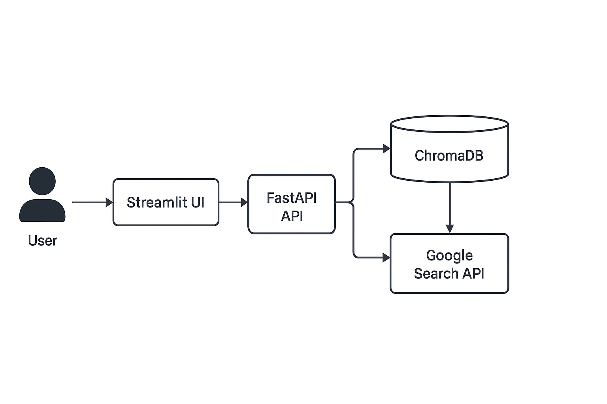

# **✨ TriKnow — RAG Assistant 📚🔎🌍**

**A powerful, polished Retrieval-Augmented Generation (RAG) assistant combining PDF & web ingestion, fast vector search (ChromaDB + sentence-transformers), and a sleek Streamlit chat UI powered by LangChain + Google generative tooling. 🌟**

---

## ✅ Highlights / TL;DR

* Upload PDFs or queue web pages → their text is chunked, embedded, and stored in ChromaDB.
* Ask natural-language questions in the Streamlit chat — the LangChain agent calls specialized tools (PDF / Web / Google) to retrieve context and generate answers.
* FastAPI backend provides ingestion + search endpoints; Streamlit provides the interactive UI.
* Observability: logs to `api.log` and Prometheus metrics via `prometheus-fastapi-instrumentator`. 📈

---

## Architecture



---

## Table of contents

1. [Features](#features-)
2. [Project structure & important files](#project-structure--important-files)
3. [Prerequisites](#prerequisites-)
4. [Quickstart — run locally](#quickstart--run-locally)
5. [Environment variables / configuration](#environment-variables--configuration)
6. [API reference (examples)](#api-reference-examples)
7. [Frontend usage (Streamlit)](#frontend-usage-streamlit)
8. [Data & storage details](#data--storage-details)
9. [Troubleshooting & notes](#troubleshooting--notes)
10. [Files](#files--quick-reference)
11. [Acknowledgements & license notes](#acknowledgements--license-notes)

---

# Features ✨

* PDF ingestion endpoint: upload PDFs, automatically chunk, embed, and store for retrieval.
* Web scraping endpoint (background tasks): ingest a URL, chunk and store content.
* Vector store: **ChromaDB** collections for PDF and web content.
* Embeddings: `sentence-transformers/all-MiniLM-L6-v2` via `langchain_huggingface`.
* LangChain agent tools: `pdf_search`, `web_data_search`, `google_search`.
* Streamlit chat UI with custom styling (background GIF, custom chat bubbles).
* Prometheus-compatible metrics for observability.
* Clean modular layout: `api_endpoints`, `pdf_data_collector.py`, `web_data_collector.py`, wrappers & tools.

---

# Project structure & important files 🗂️

```
chatbot/
├── api_endpoints/
│   ├── __init__.py
│   ├── pdf_api.py            # FastAPI router for PDF upload + search
│   └── web_api.py            # FastAPI router for web scraping + search
├── demo/                     # video demo & screenshots
├── frontend/
│   ├── background.gif
│   └── styling.py            # Streamlit CSS + GIF slowing utils
├── uploads/                  # (auto-created at runtime)
├── .gitignore
├── README.md
├── api.log                   # runtime log file (gitignored as configured)
├── api.py                    # FastAPI app entrypoint (Instrumentator + CORS)
├── app.py                    # Streamlit app entrypoint (UI + agent setup)
├── pdf_data_collector.py     # load/process PDFs -> ChromaDB
├── pdf_wrapper.py            # tool wrapper and tool class for pdf_search
├── prompt.py                 # LangChain prompt template and session-time setup
├── pydantic_models.py        # request models (QueryRequest, WebDataRequest)
├── requirements.txt
├── tools.py                  # constructs StructuredTool objects for the agent
├── web_data_collector.py     # load/process web pages -> ChromaDB
└── web_wrapper.py            # wrapper and tool class for web_data_search
```

---

# Prerequisites 🧰

* Python (recommended 3.10+)
* Git
* Internet to download models and Python packages (first run)
* Recommended: a dedicated virtual environment (venv / conda)
* If you plan to use GPU-accelerated embeddings or LLMs, install appropriate CUDA-enabled PyTorch matching your environment.

---

# Quickstart — run locally 🚀

1. **Clone**

```bash
git clone <your-repo-url>
cd chatbot
```

2. **Create & activate a virtual environment**

```bash
# Create
python -m venv .venv

# Activate
source .venv/bin/activate   # unix/macOS
# .venv\Scripts\activate    # windows
```

3. **Install dependencies**

```bash
pip install --upgrade pip
pip install -r requirements.txt
```

4. **Set environment variables**

```bash
# Required
export GEMINI_API_KEY="your_google_gemini_api_key"
export GOOGLE_API_KEY="your_google_search_api_key"
export GOOGLE_CSE_ID="your_google_custom_search_engine_id"

# optional
export SESSION_SECRET="your_secret"  # app has session middleware commented out
```

> Notes about Google search tool: The Google/SerpAPI wrappers may require their own credentials (e.g., `SERPAPI_API_KEY` or Google API credentials). Configure according to the wrapper you choose.

5. **Start the backend API (first!)**

```bash
uvicorn api:app --reload --host 127.0.0.1 --port 8000
```

6. **Start the Streamlit UI**

```bash
streamlit run app.py
```

7. **Open the UI**

* Usually `http://localhost:8501` (streamlit default)

**Important:** The Streamlit frontend expects the FastAPI backend at `http://127.0.0.1:8000` (see `app.py`). Start the API server before interacting with the UI.

---

# API reference (examples) 🧾

All API endpoints run on the FastAPI app in `api.py` (default `127.0.0.1:8000`).

---

### 1) Upload a PDF

**Endpoint**

```
POST /add_pdf/
```

**Form field**

* `file` — PDF file

**Curl example**

```bash
curl -X POST "http://127.0.0.1:8000/add_pdf/" \
  -F "file=@/path/to/your-document.pdf"
```

**Success response**

```json
{
  "message": "PDF file uploaded and processed successfully."
}
```

**Notes**

* Endpoint validates `.pdf` extension.
* PDF chunks are processed and added to the Chroma collection `pdf_data_collection`.

---

### 2) Query stored PDF data

**Endpoint**

```
POST /search_query_in_pdf/
```

**Payload**

```json
{ "input": "Explain the main idea of section 2" }
```

**Curl example**

```bash
curl -X POST "http://127.0.0.1:8000/search_query_in_pdf/" \
  -H "Content-Type: application/json" \
  -d '{"input":"your question here"}'
```

**Success response**

```json
{
  "query": "your question here",
  "results": [
    {
      "page_number": 3,
      "content": "Relevant text chunk from PDF..."
    },
    ...
  ]
}
```

---

### 3) Scrape & ingest a web page (background task)

**Endpoint**

```
POST /scrape_webdata/
```

**Payload**

```json
{ "url": "https://example.com/article" }
```

**Curl example**

```bash
curl -X POST "http://127.0.0.1:8000/scrape_webdata/" \
  -H "Content-Type: application/json" \
  -d '{"url":"https://example.com/article"}'
```

**Success response**

* `202 Accepted` and message like: `{"message": "Scraping started for https://..."}`

**Notes**

* Scraping runs in the FastAPI background task to avoid blocking the request.
* Web content is chunked and stored in `web_data_collection`.

---

### 4) Query stored Web data

**Endpoint**

```
POST /search_query_in_web/
```

**Payload**

```json
{ "input": "Summarize the article" }
```

**Curl example**

```bash
curl -X POST "http://127.0.0.1:8000/search_query_in_web/" \
  -H "Content-Type: application/json" \
  -d '{"input":"summary request"}'
```

**Success response**

```json
{
  "query": "summary request",
  "results": [
    {
      "content": "Text chunk from the scraped page...",
      "metadata": {
        "source_url": "https://example.com/article",
        "chunk_number": 1
      }
    },
    ...
  ]
}
```

---

# Frontend usage (Streamlit) 🖥️

* Sidebar controls:

  * Upload PDF (disabled re-upload by default; enable with checkbox).
  * Enter URL to queue scraping.
* Chat area:

  * Enter queries in the chat input.
  * The agent uses `pdf_search`, `web_data_search`, and `google_search` tools as available.
* Error handling:

  * Streamlit shows errors if GEMINI\_API\_KEY is missing or the backend isn't reachable.

---

# Data & storage details 📦

* **ChromaDB collections**:

  * `pdf_data_collection` — created in `pdf_data_collector.py`
  * `web_data_collection` — created in `web_data_collector.py`

* **Embeddings model**: `sentence-transformers/all-MiniLM-L6-v2` via `langchain_huggingface.HuggingFaceEmbeddings`. Initial downloads happen on first run.
* **Uploads**: `pdf_api.py` saves to `Path("uploads")` by default.

---

# Troubleshooting & important notes ⚠️

### 1) `GEMINI_API_KEY` not set

### 2) Running order

* Start FastAPI backend **before** the Streamlit UI since the UI hits `http://127.0.0.1:8000`. If the UI cannot reach the backend you'll see errors on upload/scrape actions.

### 3) Long downloads & memory

* Embedding models and Transformers may download tens or hundreds of MBs. Ensure a stable network and sufficient disk space.
* For large-scale ingestion consider a persistent Chroma service and not the default in-memory client.

### 4) Logs & metrics

* Application logs are written to `api.log` (configured in `api.py`).
* Prometheus metrics are exposed by the `instrumentator` — you can configure Prometheus to scrape the FastAPI app. (Default path provided by `prometheus-fastapi-instrumentator` is typically `/metrics`.)

### 5) Model & environment compatibility

* `torch`, `transformers`, and related packages in `requirements.txt` are pinned — on some platforms you might need a different `torch` build (CPU vs CUDA). If install fails, refer to PyTorch official install instructions for your platform.

---

# Files quick-reference (short) 📋

* `api.py` — FastAPI app and instrumentation.
* `api_endpoints/pdf_api.py` — PDF upload + search endpoints.
* `api_endpoints/web_api.py` — Web scraping + search endpoints.
* `pdf_data_collector.py` — PDF loader, chunker, embedding & storage.
* `web_data_collector.py` — Web loader, chunker, embedding & storage.
* `pdf_wrapper.py`, `web_wrapper.py` — API wrappers used by LangChain tools.
* `tools.py` — creates tools used by the LangChain agent.
* `app.py` — Streamlit UI & agent initialization.
* `frontend/styling.py` — GIF slow-down & CSS chat styles.
* `requirements.txt` — pinned Python dependencies.

---

# 🙏 Acknowledgements & License

* Built with [LangChain](https://www.langchain.com/), [ChromaDB](https://www.trychroma.com/), [HuggingFace sentence-transformers](https://huggingface.co/sentence-transformers), [Streamlit](https://streamlit.io/), [Prometheus](https://prometheus.io/), and other open-source libraries listed in `requirements.txt`.
* Licensed under the **[MIT License](LICENSE)** — feel free to use, modify, and distribute with attribution